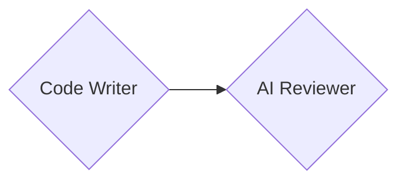
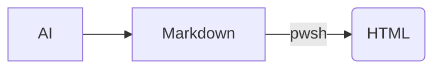

# 动嘴就能写代码：语音对话驱动的 AI 编程

## GitHub Copilot Vibe Coding 实践分享

---

#### 分享内容

- Vibe Coding
- Instructions
- Agent Skills
- Copilot Approvals And Permissions
- AI Memory

# 数据工程师的日常工作

每天都在做：

- 编写 SQL
- 开发 Stored Procedure
- 数据同步
- ETL 开发
- 数据库运维
- 数据分析

---

传统开发模式


---

AI 驱动模式


---

开发者身份转变



---

# 什么是 Vibe Coding

通过自然语言与 AI 交流，由 AI 完成开发任务。

**Option 1** 

[VS Code Speech Extension](https://marketplace.visualstudio.com/items?itemName=ms-vscode.vscode-speech-language-pack-zh-cn)


**Option 2** 
[Built-in dictation in VS Code](https://code.visualstudio.com/docs/configure/accessibility/voice#_use-built-in-dictation)


---

### 数据库vibe coding应用场景

工程师：

> 帮我写一个上月保单续保率SQL，按区域分组

AI：

- 编写 SQL
- 添加注释
- 性能优化 SQL

---

工程师：

> 帮我写个文档介绍这个GitHub Repo

AI：

- 解析项目结构，整理项目架构
- 结合上下文分析代码规范
- 输出md/html文档

---

工程师：

> 扫描全部logs并整理error报告，要求报告能链接到每个log文件

AI：

- 递归扫描所有 log 目录和文件
- 提取错误信息、时间戳分类
- 生成结构化报告（按错误类型、时间线、严重级别）
- 输出 HTML/Markdown 文档，每条错误包含源文件链接

---

工程师：

> 实现一行代码自动创建PR，创建后自动打开网页

AI:

- 查阅GitHub CLI文档
- 结合workspace和上下文获取repo名字
- 生成使用例子

---

工程师：

> /prompt-coach 我有一大堆模糊的想法，你帮我整理，并且结构化输出

AI：

- 剔除口头禅和无用信息
- 结构化整理，转换成更适合执行的 Prompt

---

# 企业落地面临的问题

## 为什么 AI 有时候并不好用？

### 原因一：缺乏上下文

AI 不知道项目背景：

* 团队编码规范
* 项目架构
* 技术栈标准
* ...

---

## 典型案例

同样一句 Prompt生成的代码，在2个类似的项目

- 项目A 输出运行正常 ✅
- 项目B 输出运行报错 ❌

---

### 原因二：不了解业务流程

刚落地的 AI 不理解：

* 开发工具配置流程
* 测试开发流程
* CI/CD流程
* ...

---

## 典型案例

AI生成的代码独立于Jira和GitHub issue中的信息。
需要截图上传文档/认为二次输入背景说明，才能完成任务。


---

### 原因三：误操作风险

AI 可能生成：

```shell
rm -rf
```

或者：

```sql
DROP TABLE POLICY_MASTER;
```

---

## 最终结果

程序员为AI背锅

---

# 企业级 AI 四件套

## 企业级 GitHub Copilot 的核心解决方案

| 痛点                 | 解决方案                |
| -------------------- | ----------------------- |
| 不懂项目背景         | Instructions            |
| 不懂业务规则         | Skills                  |
| 误删数据             | Approvals & Permissions |
| 默会知识难以书面表达 | AI Memory               |

---

# 解决方案 1：Instructions

Custom instructions enable you to define common guidelines and rules that automatically influence how AI generates code and handles other development tasks

| 特征               | copilot-instructions                   | file-based instructions                     |
| ------------------ | -------------------------------------- | ------------------------------------------- |
| **作用范围** | 整个workspace的对话                    | 特定文件的对话（e.g. sql, pkg, &pkb)        |
| **目的**     | 让AI理解项目背景和规范                 | 让AI理解特定语言的规范                      |
| **创建方式** | `/init ` <指令>                      | `/create-instructions ` <指令>            |
| **触发方式** | 默认始终加载                           | 根据文件类型、路径或匹配规则自动加载        |
| **文件位置** | .github/copilot-instructions.md        | .github/instructions/*.instructions.md      |
| **典型内容** | 架构说明、命名规范、开发流程、代码风格 | SQL规范、数据库连接规范、测试用例生成规范等 |

**Prompt for Creating Python File-based Instruction**

```md
/create-instructions  我需要创建一个python文件的规范。 我要求所有在python里面要连接数据库必须要用到oracle d b这个包
```

**Examples:**

- [copilot-instructions.md](.github/copilot-instructions.md)

- [sql-script-standard.instructions.md](.github/instructions/sql-script-standard.instructions.md)


# 解决方案 2：Agent Skills

## Prompt ≠ Skill

很多人认为

> text 把Prompt写长一点 = 专家能力

实际上：

`text Skill  = Domain Knowledge + Workflow + Best Practice + Tools`

---

目标：

> 让AI是进行某个专业领域的工作。

---

# Database Skill 示例

| 特征               | /db-query                                 | /db-action                                        |
| ------------------ | ----------------------------------------- | ------------------------------------------------- |
| **领域约束** | 限制操作类型（只读）                      | 限制操作类型（增删改） + 限制执行流程（确认机制） |
| **安全网**   | 数据字典 + 结构校验                       | 生成-执行两步式                                   |
| **学习价值** | 展示**精确边界控制** （白名单方式） | 展示**多层防护体系** （流程+确认）          |
| **业务适配** | 为读操作专业化定制                        | 为写操作设计安全体系                              |
| **用例**     | `/db-query 查员工表中,成龙的工资`     | `/db-query 查员工表中1号员工的工资`            |

# GitHub CLI Skill 示例

除了数据库场景，GitHub 操作也很适合被封装成一个可复用技能。`gh` 命令可以统一管理仓库、Issue、PR、分支、提交记录和 Release，同时通过认证检查和确认机制降低误操作风险。

| 特征               | /github-cli                                      |
| ------------------ | ------------------------------------------------ |
| **领域约束** | 限制操作范围（GitHub CLI）+ 统一命令风格        |
| **安全网**   | 认证状态检查 + 参数展示 + 确认机制 + 破坏性操作拦截 |
| **学习价值** | 展示“工具型技能”封装方式：命令、参数、输出处理、风险控制 |
| **业务适配** | 适合仓库、Issue、PR、分支、Release 等日常 GitHub 工作 |
| **用例**     | `/github-cli 检查目前有几个PR待审批`            |


# 解决方案 3：Copilot Approvals And Permissions

Permission levels are the high-level control for how much autonomy the agent has during a session.

| Permission level                      | Description                                                                                                                                                                  |
| ------------------------------------- | ---------------------------------------------------------------------------------------------------------------------------------------------------------------------------- |
| **Default Approvals** (default) | Uses your configured approval settings. Tools that**require** approval show a confirmation dialog before they run. When in doubt, the agent asks clarifying questions. |
| **Bypass Approvals**            | Auto-approves all tool calls**without** showing confirmation dialogs. When in doubt, **the agent asks clarifying questions.**                                    |
| **Autopilot**                   | Auto-approves all tool calls**without** showing confirmation dialogs. When questions arise, **the agent automatically responds** to clarifying questions.        |

# 解决方案 4: AI Memory

The memory tool is a built-in agent tool that allows agents to save and recall notes as they work

## Memory tool vs. Copilot Memory

|                                          | Memory tool                  | Copilot Memory                       |
| ---------------------------------------- | ---------------------------- | ------------------------------------ |
| **Storage**                        | Local (on your machine)      | GitHub-hosted (remote)               |
| **Scopes**                         | User, repository, session    | Repository only                      |
| **Shared across Copilot surfaces** | No (VS Code only)            | Yes (coding agent, code review, CLI) |
| **Created by**                     | You or the agent during chat | Copilot agents automatically         |
| **Enabled by default**             | Yes                          | No (opt-in)                          |
| **Expiration**                     | Manual management            | Automatic (28 days)                  |

# 不同Memory tool类型

| Scope                | Persists<br />across <br />sessions | Persists<br />across <br />workspaces | Example                                   |
| -------------------- | ----------------------------------- | ------------------------------------- | ----------------------------------------- |
| **User**       | Yes                                 | Yes                                   | 记住SQL处理日期时默认使用"YYYY-MM-DD"格式 |
| **Repository** | Yes                                 | No                                    | 记住这个项目的建表语句只使用Create TABLE <Table>  |
| **Session**    | No                                  | No                                    | 记住我只想你回复英文，无论我问你任何问题  |

Remark:

> 记忆文件路径为 `~/Library/Application Support/Code/User/globalStorage/github.copilot-chat/memory-tool`

# 实验： md文档转换html工具

## User Story

AI生成html文档十分耗费tokens，我希望降低tokens消耗，减少成本。

## Techical Design



## Prompt

```md
/plan
我想你做个PowerShell脚本帮我把md文档转换成html，要求输出的格式简约，但是不失美感，符合商业场景的使用。

我要你支持markdown高级图表处理, 包括Mermaid图表

脚本要自动从markdown文件中提取第一个标题作为HTML的标题

脚本解决pandoc生成的标题重复问题。

CSS内嵌到HTML文件中
```

## Smoke Test

```shell
pwsh -File ./02Development_Zone/Convert-MarkdownToHtml.ps1 \
        -InputFile vibe-coding.md \
        -OutputFile vibe-coding.html
```
